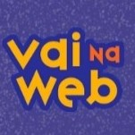

# Projeto "Tô de Cacho - Salon Line"

>O projeto criado a fim de estudos pelo Vai na Web, mostra minha desenvoltura com a estrutura básica do HTML, os principais metodos de estilização com CSS3 e algumas experimentações com o JavaScript. Enjoy (♡ε♡) 

|||||| ||||||| ||||||
|:---:|:---:|:---:|:---:|:---:|:---:|:---:|:---:|:---:|:---:|:---:|:---:|:---:|:---:|:---:|:---:|:---:|:---:|

